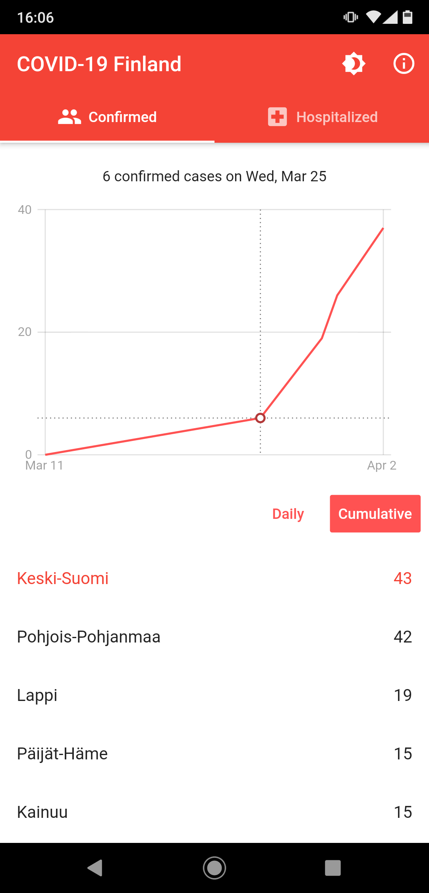
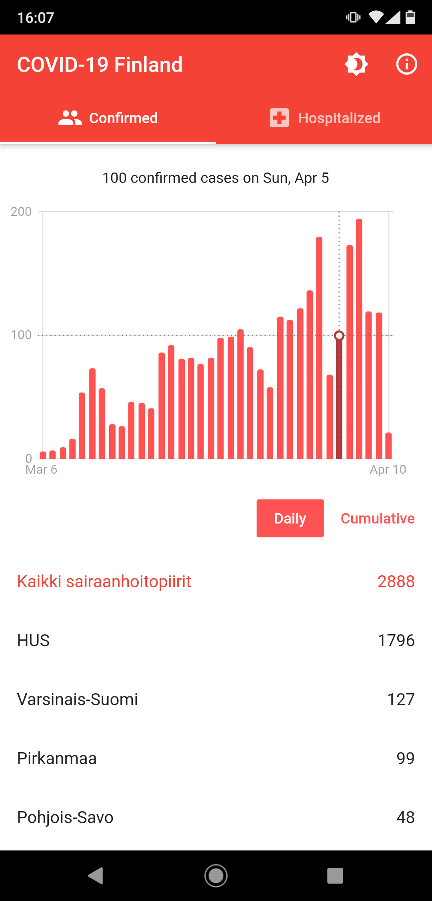
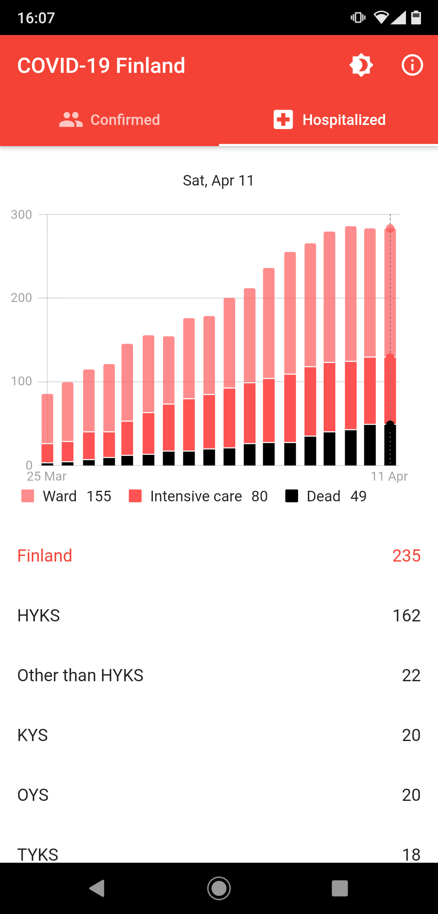
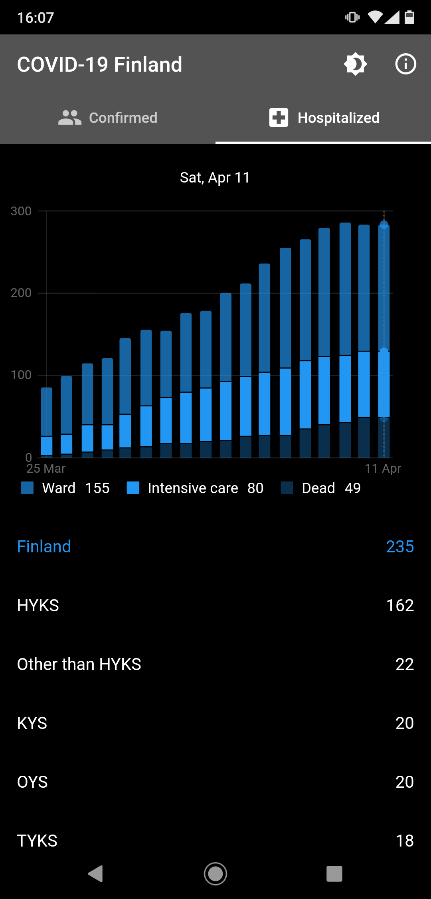
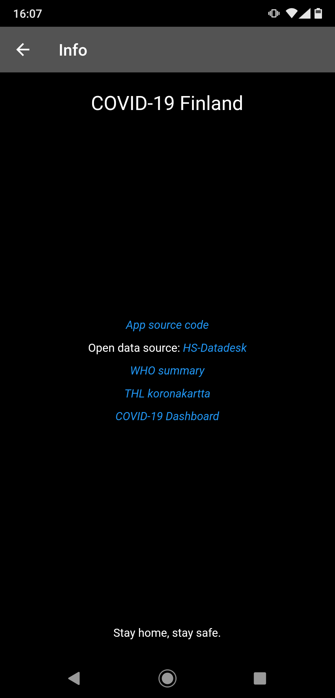

# COVID-19 Stats Finland

The app has 2 main screens: confirmed and hospitalized:
 - Confirmed screen shows stats of confirmed COVID-19 cases in Finland
 - Hospitalized screen shows distribution of people in ward (on date) / intensive care (on date) / dead (to date, total)

## Data

The app is using open data obtained from [HS-Datadesk](https://github.com/HS-Datadesk/koronavirus-avoindata), which is publishing processed data from [THL (Terveyden ja hyvinvoinnin laitos)](https://thl.fi/)

# Platform support

The app is tested to run on Android and iOS, but should also work on macOS and, possibly, web.

# App distribution

Small scale COVID-19 related apps are not allowed to be distributed through Google Play, and this app is no exception.

Self signed release build is available here: [app-release.apk](/raw/master/apk/app-release.apk)