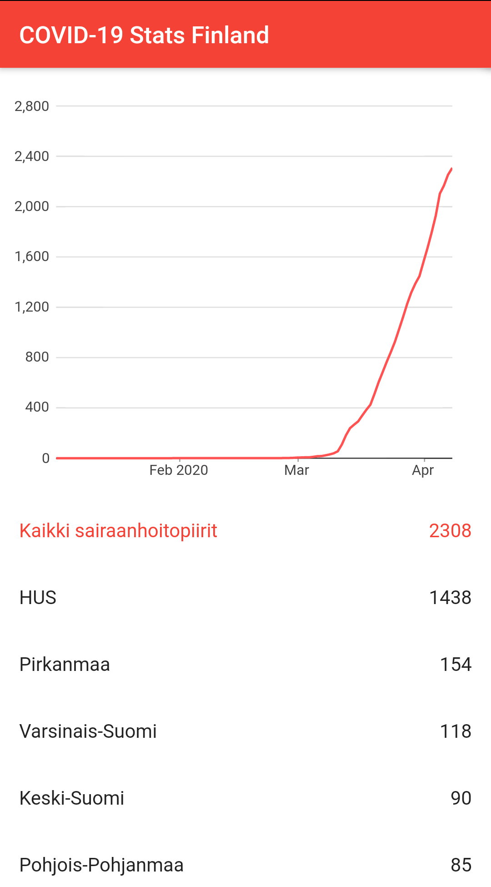

# COVID-19 Stats Finland

The app visualizes stats of confirmed COVID-19 cases in Finland

## Data

The app is using open data obtained from [HS-Datadesk](https://github.com/HS-Datadesk/koronavirus-avoindata), which is publishing processed data from [THL (Terveyden ja hyvinvoinnin laitos)](https://thl.fi/)